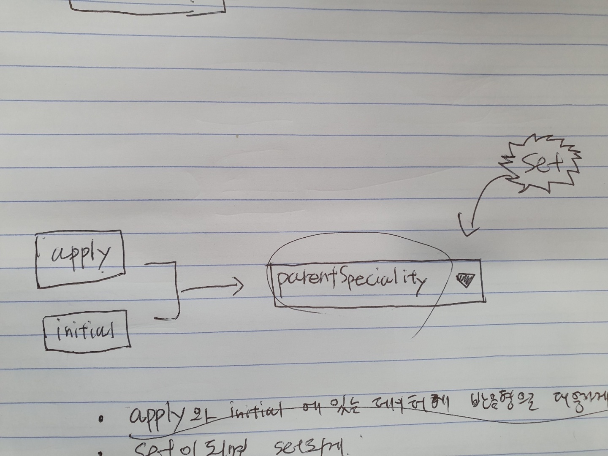

# 상황

서핏의 광고주(이하 사용자)는 채용광고를 신청할 수 있고, 중간 저장을 하기 때문에 나중에 신청 진행 정보를 다시 가져올 수 있다. 하지만 간헐적으로 채용 분야, 전문 분야 정보가 로드되지 않는 문제가 있었다.

## apply 데이터

신청은 여러 단계로 나눠져 진행하게 되는데, 이 단계별로 상태가 저장되기에 사용자는 신청 과정이 중단되더라도 나중에 다시 작성을 할 수 있다. 여기서 이 신청 진행 정보를 서핏 프로덕트 팀에서는 **apply** 데이터라고 부른다. 여러개라면 당연히 applies.

서핏의 채용광고에는 개발, 디자인, 기획, 마케팅의 채용 분야(이하 parent)와 개발이라면 프론트엔드, 백엔드, 데이터 엔지니어 등 전문 분야(이하 child)를 Dropdown UI를 이용해서 설정할 수 있다.


apply 데이터에는 한가지 어려운점이 있는데, **parent를 저장하지 않는다는 점이다.**

## initial 데이터

애플리케이션을 구동하기 위한 각종 설정 데이터를 반환해주는 api이다. 애플리케이션 단위의 데이터들이 존재하는데 이번 글에서는 전체 직군정보(이하 speciality)가 있다는 것만 알면 된다.

speciality는 개발, 디자인, 기획, 마케팅같은 채용 분야 데이터와 각 채용 분야의 하위 전문 분야 데이터가 2계층 구조로 이루어진 데이터이다.

리로드하면 항상 먼저 호출하는 데이터이다. (호출은 먼저 할지언정 데이터가 항상 먼저 로드된다는 보장은 못함)

## 정상적인 동작

채용 광고 신청 진행 정보(apply)를 가져오면 child의 key와 initial 데이터의 speciality를 이용해서 parent를 찾은 뒤, 두 dropdown을 표현하기 위해서 인스턴스의 data에 주입한다. 그럼 정상적으로 dropdown이 보인다.

현재 parent dropdown의 상황을 그림으로 표현했다.



## 비정상적인 동작

apply 데이터를 가져왔지만 initial 데이터가 준비되지 않았다면 child의 key를 이용하더라도 speciality가 없기 때문에 parent를 찾을 수 없다. 그렇게 되면 dropdown에 값이 없는것을 발견할 수 있다.

# 해결 과정

## 참고사항
* child id는 parent가 바뀌면 null로 바뀐다.

## 요구사항

1. 위의 비정상적인 동작을 해결하기 위해서 dropdown의 v-model에 붙어있는 데이터를 reactive(반응형)하게 수정할 필요가 있었다.
2. dropdown의 v-model에 붙어있는 데이터는 일반적인 수정 액션에도 반응이 되어야 한다.
3. child id가 있을 때 child id를 가지고 부모를 찾아야 한다 reactive하게.

## 해결 방법

```js
data: () => ({
	...
	parentIdChangedByDropdown: null,
	...
}),

computed: {
	...
	parent() {
        return this.speciality.find(parent => parent.children.find(child => child.id === this.childIdFromApply));
    },
	computedParentSpecialityId: {
        get() {
        	// parent가 바뀌면 null로 바뀌기 때문에 apply 데이터가 로드되었을 때 parent id를 리턴하고,
        	// 그 이후에 parent가 바뀌면 dropdown change로 인해 바뀐 값을 리턴한다.
            if (this.childIdFromApply) {
                return this.parent.id;
            }

            return this.parentIdChangedByDropdown;
        },
        set(newParentId) {
            this.parentIdChangedByDropdown = newParentId;
        }
    },
	...
},
```

되게 꾸역꾸역 해결했지만, 나중에 이런 패턴을 또 만나면 더 나은 해결 방안을 만들어야 함.