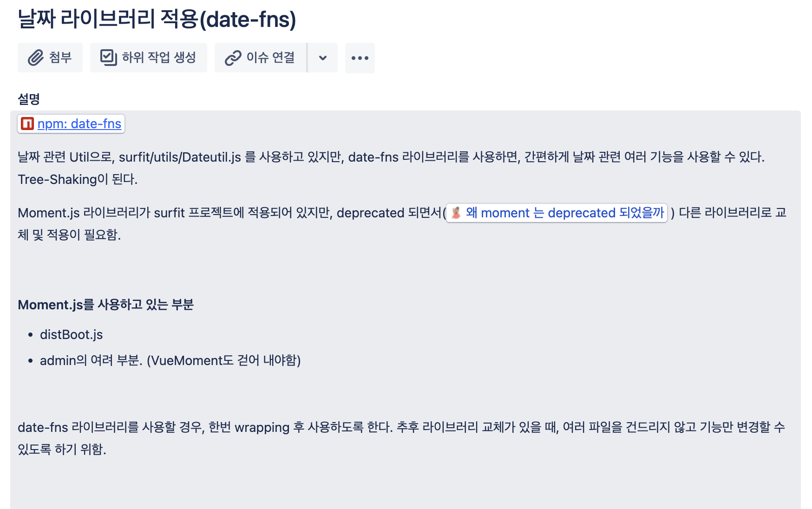

# 상황

기존 서핏 애플리케이션은 moment를 이용해서 시간 데이터를 다뤘다. moment는 라이브러리만의 시간 객체를 사용했고, 우리 개발조직에서는 시간 데이터를 조금 더 표준화된 방식으로 사용하고자 하는 의지가 있었다.

그래서 다른 라이브러리를 찾아보던 차에 date-fns라는 것을 알게 되었다. date-fns는 시간에 관련된 작업을 기능 단위로 제공하고 시간 그 자체의 데이터는 `new Date()`를 사용해서 다루고 있었다. 딱 우리 조직이 원하는 것이였다.

교체할 라이브러리를 date-fns로 정하고 시간 데이터가 사용된 모든 곳을 분석하고 있었는데, 영강님이 프로젝트 내부에서 사용할 인터페이스를 만들고 교체하는 편이 좋을 것 같다고 조언을 해주셨다.

이유는

**인터페이스가 있으면 변화에 쉽게 대응할 수 있다!**

"시간 관련 라이브러리가 아니더라도 이런 유틸성 라이브러리들을 교체할 때 인터페이스가 있다고 가정해 봅시다! 나중에 그 인터페이스에서 의존하는 라이브러리만 교체해주면 정말 쉽게 교체 작업을 마무리지을 수 있어요"

그렇게 분석한 결과를 가지고 인터페이스를 먼저 만들게 되었다!

# 배운점

어떤 일이 일어났을 때 생기는 이펙트들을 빠르고 섬세하게 캐치해내는 능력이 실력차이를 만드는 핵심 요소라는 것을 알았다!